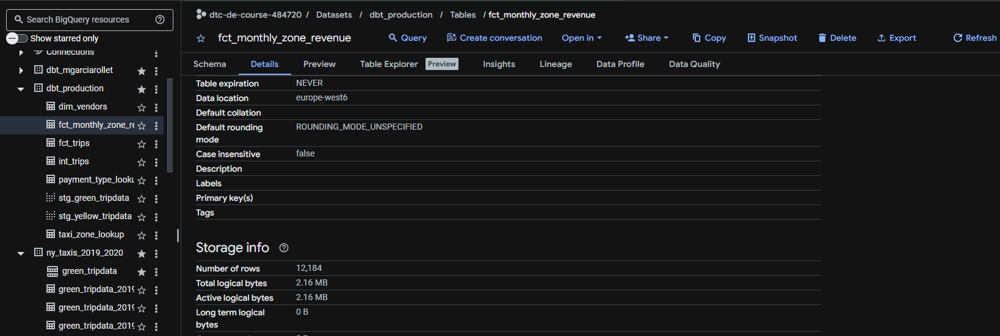
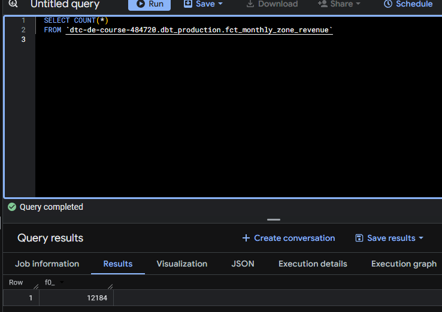
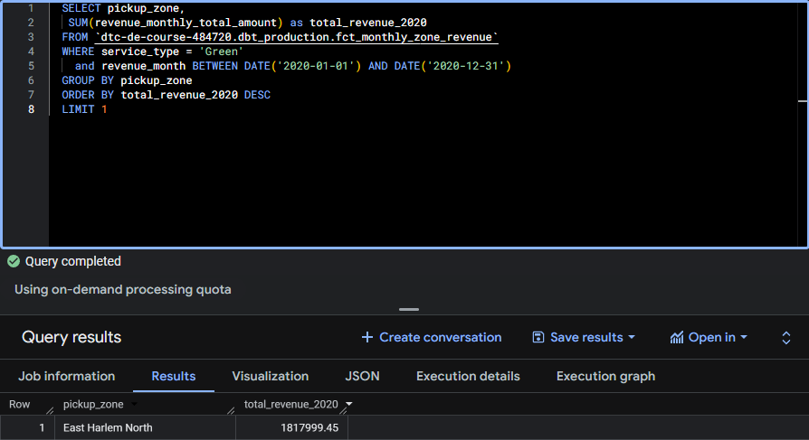
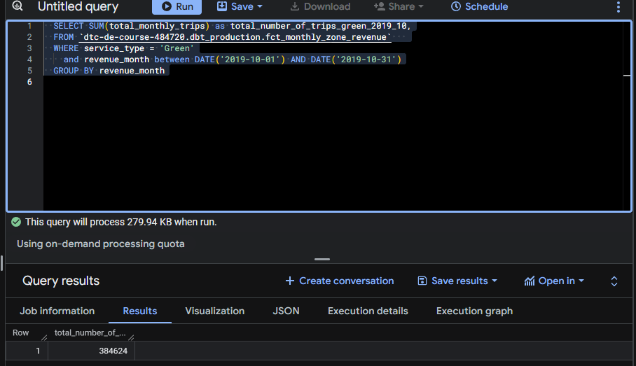
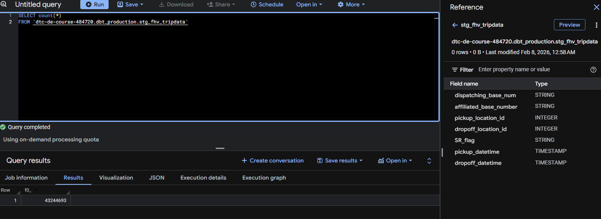

# Module 4 Homework: Analytics Engineering with dbt

In this homework, we'll use the dbt project in `04-analytics-engineering/taxi_rides_ny/` to transform NYC taxi data and answer questions by querying the models.

## Setup

1. Set up your dbt project following the [setup guide](../../../04-analytics-engineering/setup/)
2. Load the Green and Yellow taxi data for 2019-2020 into your warehouse
3. Run `dbt build` to create all models and run tests

After a successful build, you should have models like `fct_trips`, `dim_zones`, and `fct_monthly_zone_revenue` in your warehouse.

---

### Question 1. dbt Lineage and Execution

Given a dbt project with the following structure:

```
models/
├── staging/
│   ├── stg_green_tripdata.sql
│   └── stg_yellow_tripdata.sql
└── intermediate/
    └── int_trips_unioned.sql (depends on stg_green_tripdata & stg_yellow_tripdata)
```

If you run `dbt run --select int_trips_unioned`, what models will be built?

- `stg_green_tripdata`, `stg_yellow_tripdata`, and `int_trips_unioned` (upstream dependencies)
- Any model with upstream and downstream dependencies to `int_trips_unioned`
- X `int_trips_unioned` only (as there's no '+' around the selected model and dbt build has been run before so previous models have already been built (so no need to rebuild them))
- `int_trips_unioned`, `int_trips`, and `fct_trips` (downstream dependencies)

---

### Question 2. dbt Tests

You've configured a generic test like this in your `schema.yml`: ?test for the fct_trips model?

```yaml
columns:
  - name: payment_type
    data_tests:
      - accepted_values:
          arguments:
            values: [1, 2, 3, 4, 5]
```

Your model `fct_trips` has been running successfully for months. A new value `6` now appears in the source data.

What happens when you run `dbt test --select fct_trips`?

- ? dbt will skip the test because the model didn't change (DOES dbt test --select works as dbt run --select (for rebuild dependencies?))
- ? dbt will fail the test, returning a non-zero exit code (whatever you do the build will bring in the new value and break the test)
- dbt will pass the test with a warning about the new value
- dbt will update the configuration to include the new value

---

### Question 3. Counting Records in `fct_monthly_zone_revenue`

After running your dbt project, query the `fct_monthly_zone_revenue` model.



```sql
  SELECT COUNT(*)
  FROM `dtc-de-course-484720.dbt_production.fct_monthly_zone_revenue`   
```


What is the count of records in the `fct_monthly_zone_revenue` model?
- 12,998
- 14,120
- X 12,184
- 15,421

---

### Question 4. Best Performing Zone for Green Taxis (2020)

Using the `fct_monthly_zone_revenue` table, find the pickup zone with the **highest total revenue** (`revenue_monthly_total_amount`) for **Green** taxi trips in 2020.

Which zone had the highest revenue?

```sql
  SELECT pickup_zone,
   SUM(revenue_monthly_total_amount) as total_revenue_2020
  FROM `dtc-de-course-484720.dbt_production.fct_monthly_zone_revenue`   
  WHERE service_type = 'Green'
    and revenue_month BETWEEN DATE('2020-01-01') AND DATE('2020-12-31')
  GROUP BY pickup_zone
  ORDER BY total_revenue_2020 DESC
  LIMIT 1
```


- X East Harlem North
- Morningside Heights
- East Harlem South
- Washington Heights South

---

### Question 5. Green Taxi Trip Counts (October 2019)

Using the `fct_monthly_zone_revenue` table, what is the **total number of trips** (`total_monthly_trips`) for Green taxis in October 2019?
```sql
  SELECT SUM(total_monthly_trips) as total_number_of_trips_green_2019_10,
  FROM `dtc-de-course-484720.dbt_production.fct_monthly_zone_revenue`   
  WHERE service_type = 'Green'
    and revenue_month between DATE('2019-10-01') AND DATE('2019-10-31')
  GROUP BY revenue_month
```


- 500,234
- 350,891
- X 384,624
- 421,509

---

### Question 6. Build a Staging Model for FHV Data

Create a staging model for the **For-Hire Vehicle (FHV)** trip data for 2019.

1. Load the [FHV trip data for 2019](https://github.com/DataTalksClub/nyc-tlc-data/releases/tag/fhv) into your data warehouse
See instructions in [extras](./extras/README.md)
2. Create a staging model `stg_fhv_tripdata` with these requirements:
   - Filter out records where `dispatching_base_num IS NULL`
   - Rename fields to match your project's naming conventions (e.g., `PUlocationID` → `pickup_location_id`)

```sql
SELECT count(*) 
FROM `dtc-de-course-484720.dbt_production.stg_fhv_tripdata` 
```



What is the count of records in `stg_fhv_tripdata`?

- 42,084,899
- X 43,244,696
- 22,998,722
- 44,112,187

